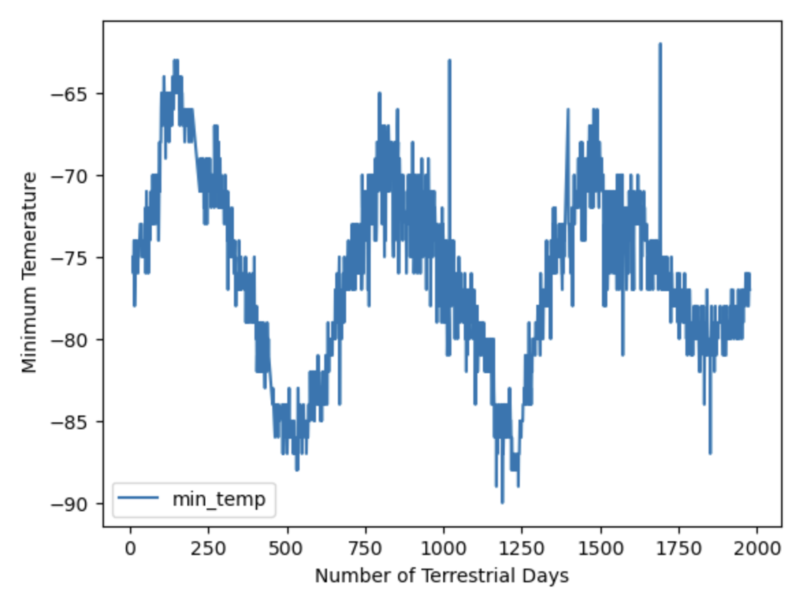

# Mission-to-Mars

## Overview
In this challenge the task was to help an aerospace company, SpaceForward (a fictitious company) that is doing research about resource extraction from nearby planets. The data needed includes information about the climate on Mars as well as news items about Mars missions. To gather the information public websites are scrapped to collect titles and preview text from recent Mars news articles and to analyze a Mars weather data table.

## Resources

- Software:
    - Visual Studio Code (Version: 1.76.2)
    - Jupyter Notebook
        - Automated browsing with Splinter
- Data pulled from public wedsites:
    - Mars NASA News Site https://redplanetscience.com/
    - Mars Temperature Data Site  https://data-class-mars-challenge.s3.amazonaws.com/Mars/index.html  

## Results

### Generated Code 

- Deliverable 1: Scrape Titles and Preview Text from Mars News Code
[deliverables/part_1_mars_news.ipynb](deliverables/part_1_mars_news.ipynb)

- Deliverable 2: Scrape and Analyze Mars Weather Data
[deliverables/part_2_mars_weather.ipynb](deliverables/part_2_mars_weather.ipynb)

### Visualizations 

#### Mars News Dictionary

[images/mars_news_dictionary.png](images/mars_news_dictionary.png)

#### Mars News DataFrame

[images/news_data_df.png](images/news_data_df.png)

#### Mars Weather DataFrame

[images/mars_weather_df.png](images/mars_weather_df.png)

#### Mars Months

[images/mars_months.png](images/mars_months.png)
- There are 12 months on Mars.

#### Mars Months

[images/data_days.png](images/data_days.png)
- There were 1,867 Martian days' worth of data collectd and analyzed. 

#### Average Temperature by Month

[images/avg_temp_ordered_bar.png](images/avg_temp_ordered_bar.png)
- On average, the third month has the coldest minimum temperature on Mars, and the eighth month is the warmest.

#### Average Pressure by Month

[images/avg_pressure_bar.png](images/avg_pressure_bar.png)
- Atmospheric pressure is, on average, lowest in the sixth month and highest in the ninth.

#### Eearth Days in a Martian Year

[images/mars_years:earth_days.png](images/mars_years:earth_days.png)
- The distance from high peak to high peak is roughly 750-1425, or 675 days. A year on Mars appears to be about 675 days from the ploted data. An internet search confirms that a Mars year is equivalent to 687 earth days.

